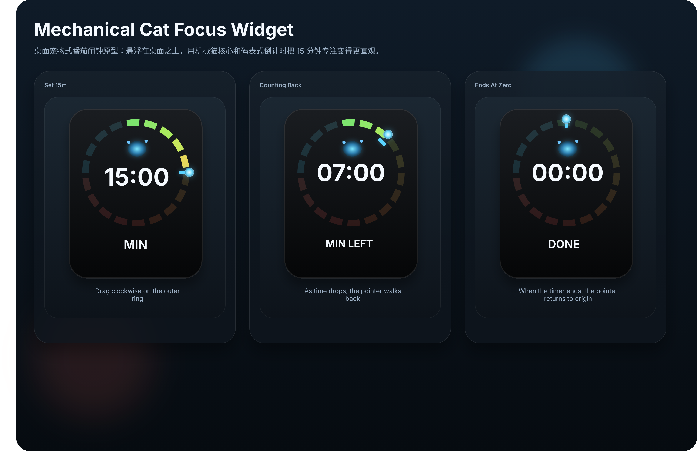

# fanqieclock

A native macOS floating pomodoro widget built with `SwiftUI + AppKit`.

It stays above other windows, supports drag-to-set time on a circular dial, shows a compact transparent desktop widget, and includes a full-screen "strong reminder" overlay when a session ends.



## Features

- Native macOS floating widget using `NSPanel`
- Transparent compact desktop-style UI
- Drag the outer ring to set the timer
- Click the cat face to start or pause
- Countdown pointer moves back to zero as time decreases
- Full-screen strong reminder overlay when focus ends
- Menu bar access and quick actions
- Persistent settings window for:
  - default focus duration
  - widget scale
  - strong reminder toggle
  - reminder sound toggle
  - drag handle visibility

## Tech Stack

- Swift 6
- SwiftUI
- AppKit
- Swift Package Manager

## Project Structure

```text
Sources/fanqie/
  AppDelegate.swift
  AppSettings.swift
  CompletionOverlayController.swift
  DialWidgetView.swift
  FanqieApp.swift
  FloatingPanelController.swift
  FloatingWidgetRootView.swift
  SettingsWindowController.swift
  TimerStore.swift
```

## Run Locally

### Option 1: Open in Xcode

1. Open the folder as a Swift package in Xcode.
2. Build and run the `fanqie` executable target.

### Option 2: Run from terminal

If your machine uses the full Xcode toolchain:

```bash
swift build
./.build/arm64-apple-macosx/debug/fanqie
```

If `swift build` is still pointing at Command Line Tools instead of full Xcode, run:

```bash
DEVELOPER_DIR=/Applications/Xcode.app/Contents/Developer swift build
./.build/arm64-apple-macosx/debug/fanqie
```

## Current Interaction Model

- Drag the outer ring clockwise to set the duration
- Click the cat face to start or pause
- Right click the widget for presets, settings, reset, and reminder testing
- Use the menu bar item `番茄` to reopen the widget or open settings

## Notes

- The app is currently implemented as a native executable Swift package, not an `.xcodeproj`.
- The floating widget is tuned for desktop use and may still need further polish around hit testing and animation feel.

