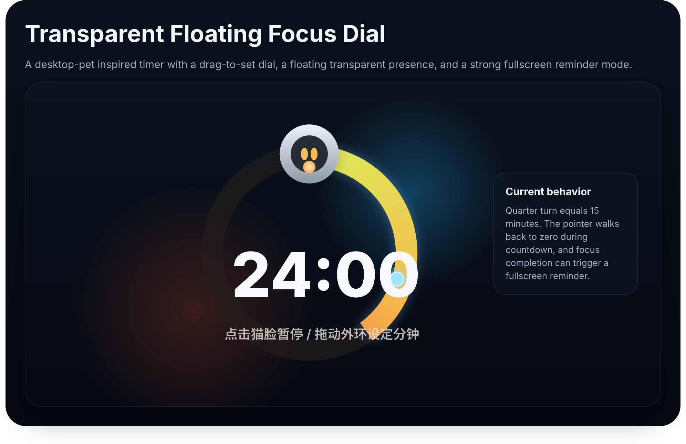

# fanqieclock

A native macOS floating pomodoro widget built with `SwiftUI + AppKit`.

It stays above other windows, supports drag-to-set time on a circular dial, shows a compact transparent desktop widget, and includes a full-screen "strong reminder" overlay when a session ends.



## Features

- Native macOS floating widget using `NSPanel`
- Transparent compact desktop-style UI
- Drag the outer ring to set the timer
- Click the cat face to start or pause
- Countdown pointer moves back to zero as time decreases
- Full-screen strong reminder overlay when focus ends
- Read today's tasks from Todoist
- Menu bar access and quick actions
- Persistent settings window for:
  - default focus duration
  - widget scale
  - strong reminder toggle
  - reminder sound toggle
  - drag handle visibility
  - Todoist token setup hints

## Tech Stack

- Swift 6
- SwiftUI
- AppKit
- Swift Package Manager

## Project Structure

```text
Sources/fanqie/
  AppDelegate.swift
  AppSettings.swift
  CompletionOverlayController.swift
  DialWidgetView.swift
  FanqieApp.swift
  FloatingPanelController.swift
  FloatingWidgetRootView.swift
  SettingsWindowController.swift
  TodayTasksStore.swift
  TodayTasksWindowController.swift
  TimerStore.swift
  TodoistClient.swift
```

## Run Locally

### Option 1: Open the macOS app project in Xcode

1. Open `FanqieClock.xcodeproj` in Xcode.
2. Select the `FanqieClock` scheme.
3. Press `Run`.

This path builds a standard macOS `.app` bundle, which is the recommended workflow if you want the project to behave like a normal desktop app.

After a successful build, the app bundle will be inside Xcode's build products, or in the custom derived data folder if you build from terminal.

### Option 2: Build the `.app` from terminal

```bash
cd "/Users/guoziyi/Documents/New project 2/fanqie"
env DEVELOPER_DIR=/Applications/Xcode.app/Contents/Developer \
xcodebuild \
  -project FanqieClock.xcodeproj \
  -scheme FanqieClock \
  -configuration Debug \
  CODE_SIGNING_ALLOWED=NO \
  -derivedDataPath ./.xcodebuild \
  build
```

The generated app will be at:

```text
./.xcodebuild/Build/Products/Debug/FanqieClock.app
```

### Option 3: Keep using the Swift Package executable

```bash
DEVELOPER_DIR=/Applications/Xcode.app/Contents/Developer swift build
./.build/arm64-apple-macosx/debug/fanqie
```

This path is still useful for quick local development, but the Xcode project is now the primary way to get a normal macOS app bundle.

## Todoist Setup

The app reads your daily tasks from Todoist using the `today` filter and the `TODOIST_API_TOKEN` environment variable.

### If you run the Swift executable from Terminal

```bash
export TODOIST_API_TOKEN="your_todoist_token"
./.build/arm64-apple-macosx/debug/fanqie
```

### If you launch the macOS app bundle like a normal desktop app

```bash
launchctl setenv TODOIST_API_TOKEN "your_todoist_token"
```

Then fully quit and relaunch `FanqieClock.app`.

To clear it later:

```bash
launchctl unsetenv TODOIST_API_TOKEN
```

## Current Interaction Model

- Drag the outer ring clockwise to set the duration
- Click the cat face to start or pause
- Right click the widget for presets, settings, reset, and reminder testing
- Use the menu bar item `番茄` to reopen the widget, open settings, or inspect today's Todoist tasks

## Notes

- The repo now includes both a Swift package executable and a standard macOS Xcode app project.
- The floating widget is tuned for desktop use and may still need further polish around hit testing and animation feel.
